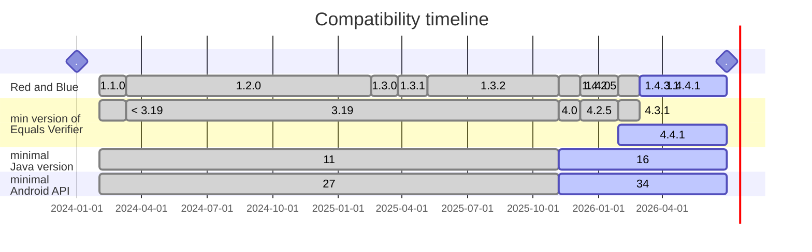

# Version matching

## Why?
To populate the objects, Red-and-Blue Extension relies on the internal object factories from the EqualsVerifier library.
This API, though open-source, is internal to EqualsVerifier - which means it might change in a new version, and Red-and-Blue
has to adapt.

Hence, newer versions of Red-and-Blue extension are not compatible with older versions of EqualsVerifier, and vice versa.

## Android support

It is perfectly possible to run Android Tests with Red-and-Blue Extension. Just keep in mind that, because Android's
implementation of new Java API (such as streams or records) tends to lag behind, not every Android image will be able to
run a test with Red-and-Blue Extension. Consult the table below to see what image you require for your emulator. 

You don't have to elevate your `minSdkVersion` just for this reason, though. This extension will check in runtime that
the actual API level is OK. 


# Versions compatibility

| Red-and-Blue | Equals Verifier | min Java version | min Android API |
|--------------|-----------------|------------------|-----------------|
|   1.1.0      |   < 3.17        | 11               | 27              |
|   1.2.0      |  >= 3.17        | "                | "               |
|   1.3.0      |  >= 3.19        | "                | "               |
|   1.3.2      |  >= 3.19 < 4.0  | "                | "               |
|   1.4.0      |  >= 4.0 < 4.2.5 | 16               | "               |
|   1.4.2.5    |  >= 4.2.5       | "                | 34              |
|   1.4.3.1    |  >= 4.3.1       | "                | "               |
|   1.4.4.1    |  >= 4.4.1       | "                | "               |




# Pinning the exact version of EqualsVerifier

Red-and-Blue brings the latest version of EqualsVerifier as a transient dependency. This adds a bit of non-determinism to
your builds when a new version of EqualsVerifier is released. Though it shouldn't normally be a problem, if you want your
builds to be 100% deterministic, you can pin the dependency version like below: 

Gradle
```groovy
dependencies {
    testImplementation 'io.github.neboskreb:red-and-blue:1.4.0'
    // pin the version of EqualsVerifier:
    testImplementation 'nl.jqno.equalsverifier:equalsverifier:4.2.2'
    ...
}
```

If in your project you already used EqualsVerifier, you probably have it pinned already.
